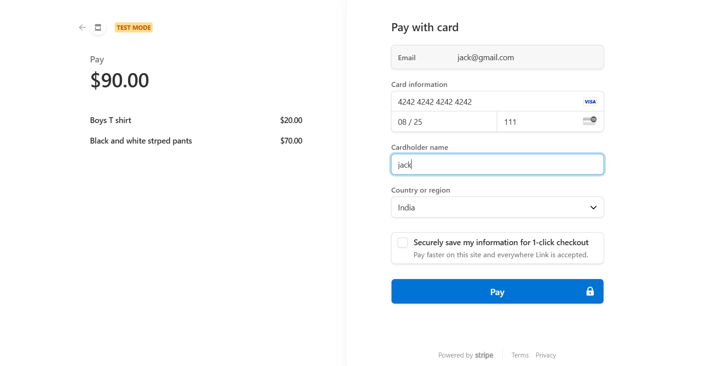

# E-Commerce Clothing Store  🛍️

A sleek, fully-featured **online clothing store** built using modern technologies, offering a smooth shopping experience with a user-friendly interface, secure payment options, and efficient state management.

This platform includes a powerful **headless CMS** powered by **Strapi**, **Stripe** integration for seamless payments, and dynamic content management. The app is optimized for both performance and usability, making it the perfect solution for an online fashion store.

 **🛍️Live Demo -**  https://e-commerce-react-git-main-bhupesh-ahers-projects.vercel.app/

## Features

- **Dynamic Product Catalog**:
    - Browse a variety of categories such as **New Arrivals**, **Trending**, and **Top Rated**.
    - Product listings with high-quality images, detailed descriptions, and prices.
- **Shopping List**:
    - Add products to your shopping list with a simple click and easily manage your selections before checkout.
- **Streamlined Checkout**:
    - **Formik** is used for managing the checkout form, ensuring smooth form validation and user input handling (e.g., address, payment details).
    - **Stripe** payment integration ensures secure and quick transactions with support for credit/debit cards.
- **Content Management with Strapi**:
    - Backend content is dynamically managed via **Strapi**, making it easy to add, update, and manage products, categories, and user data without needing to touch the code.
- **Cloud Image Storage**:
    - **Cloudinary** stores and optimizes product images, providing fast, scalable image delivery.
- **Fully Responsive**:
    - The app is designed to work seamlessly across different screen sizes, from mobile to desktop, with a mobile-first approach.

## Screenshots

  
## Technologies

- **Frontend**:
    - **React.js**: For building a fast, interactive user interfaces.
    - **Tailwind CSS**: A utility-first CSS framework for a responsive and customizable design.
    - **ShadCN**: Component library for modern UI components, helping maintain consistency in design.
    - **React-Redux**: State management for handling user data and shopping list.
    - **React-Router-Dom**: For easy routing between different pages of the app.
    - **Formik**: Simplifies form handling and validation in the checkout process.
- **Backend**:
    - **Strapi**: Headless CMS for flexible and customizable content management, including product information, categories, and user data.
- **Payment Integration**:
    - **Stripe**: Secure payment processing platform for handling online transactions.
- **Cloud Image Hosting**:
    - **Cloudinary**: A powerful cloud storage and image management platform for fast and scalable image delivery.

## How It Works

1. **Frontend Interactivity**:
    - Users can browse products by category and add items to their shopping list.
    - **React-Redux** manages the shopping list state, providing real-time updates and ensuring the user’s selections are saved as they proceed through the checkout process.
2. **Checkout Process**:
    - Once the user is ready to checkout, they are prompted to fill in their details using a **Formik-powered form**, ensuring smooth validation and submission of data.
    - The **Stripe** payment gateway allows users to securely make payments through credit or debit cards.
3. **Content Management**:
    - All product information, images, and categories are stored and managed via **Strapi**.
    - Content is dynamically fetched from the **Strapi API** to update the frontend in real-time.
4. **Cloud Image Management**:
    - Product images are hosted on **Cloudinary**, which optimizes and delivers images based on the user’s device and screen resolution, ensuring fast load times.

## Performance Optimizations

- **Efficient Product Data Fetching**:
    - Data is dynamically fetched from the **Strapi API** to ensure that the latest products and content are always displayed to the user.
    - Product images are optimized and served via **Cloudinary** for faster load times and better performance, especially on mobile devices.
- **Responsive Design**:
    - Built with **Tailwind CSS**, the app is responsive and works seamlessly across all devices, whether on mobile, tablet, or desktop.
- **Optimized State Management**:
    - **Redux** ensures a smooth experience by efficiently managing state throughout the app, whether it's tracking the shopping list, handling form data, or updating product categories.
- **Fast and Secure Payment Processing**:
    - **Stripe** handles secure payment transactions, ensuring a smooth and reliable payment experience for users.